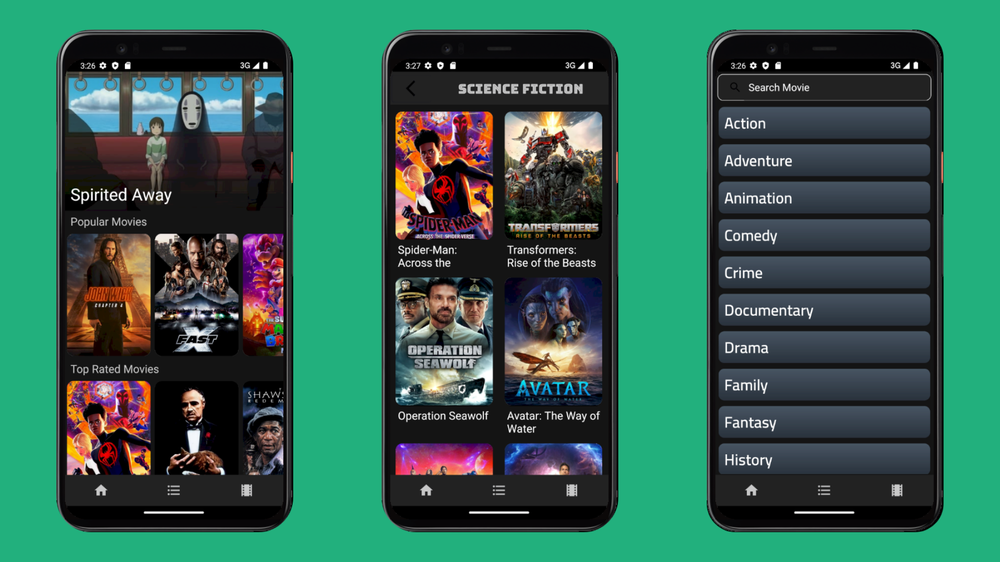

# MoviesApp
Movies App is a Android project using [TMDB API](https://developers.themoviedb.org/3/getting-started/introduction) and Modern Architecture

##  Features 🌟 
*   Discover the most popular and the top rated movies
*   See movie overview and imdb ratings
*   Create a watch list for yourself
*   Advanced uses of Room
*   MVVM with Android Architecture Components(Room, LiveData, ViewModel)
*   Pagination and endless scrolling using Android paging library

## Build With 🛠

- [Kotlin](https://kotlinlang.org/) - First class and official programming language for Android development.
- [Coroutines](https://kotlinlang.org/docs/reference/coroutines-overview.html) - For managing background threads with simplified code and reducing needs for callbacks.
- [Flow](https://developer.android.com/kotlin/flow) - A cold asynchronous data stream that sequentially emits values and completes normally or with an exception.
- [Android Architecture Components](https://developer.android.com/topic/libraries/architecture) : A collection of libraries that help you design robust, testable, and maintainable apps.
  - [Room](https://developer.android.com/training/data-storage/room) - Local database.
  - [Lifecycles](https://developer.android.com/jetpack/androidx/releases/lifecycle) - Create a UI that automatically responds to lifecycle events.
  - [LiveData](https://developer.android.com/reference/kotlin/androidx/lifecycle/LiveData) - Build data objects that notify views when the underlying database changes.
  - [ViewModel](https://developer.android.com/reference/android/arch/lifecycle/ViewModel) - Is a class that is responsible for preparing and managing the data for an Activity or a Fragment. It also handles the communication of the Activity / Fragment with the rest of the application
  - [ViewBinding](https://developer.android.com/topic/libraries/view-binding) - Generates a binding class for each XML layout file present in that module and allows you to more easily write code that interacts with views.
  - [Paging3](https://kotlinlang.org/) - Load and display small chunks of data at a time.
  - [Navigation](https://developer.android.com/jetpack/androidx/releases/navigation) - Build data objects that notify views when the underlying database changes.
- [UI](https://developer.android.com/topic/architecture/ui-layer) : Details on why and how to use UI Components in your apps.
  - [Fragment](https://developer.android.com/reference/android/app/Fragment) - A basic unit of composable UI.
  - [Layout](https://developer.android.com/develop/ui/views/layout/declaring-layout) - Layout widgets using different algorithms.
- [Retrofit](https://square.github.io/retrofit/) - Type-safe HTTP client for Android.
- [Dagger Hilt](https://developer.android.com/training/dependency-injection/hilt-android) - For dependencies injection.
- [Glide](https://bumptech.github.io/glide/) - For image loading.
